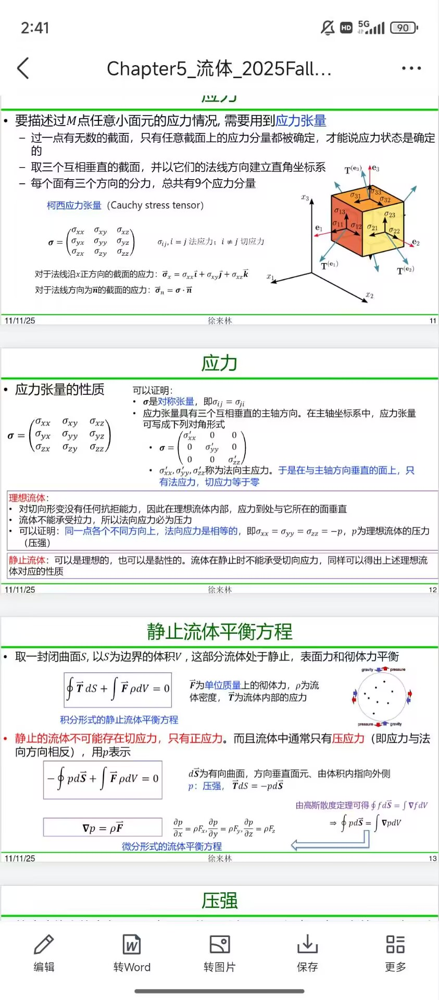
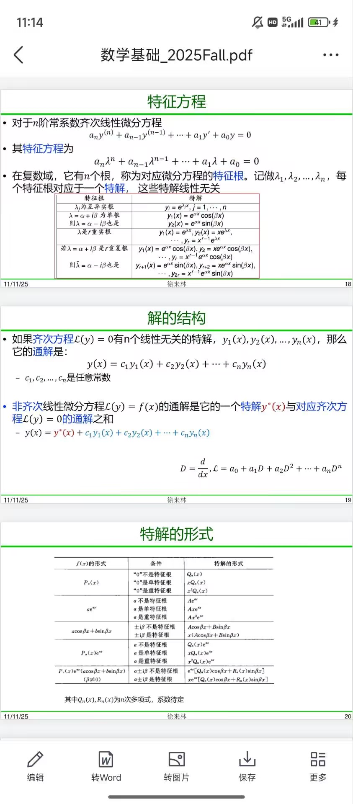
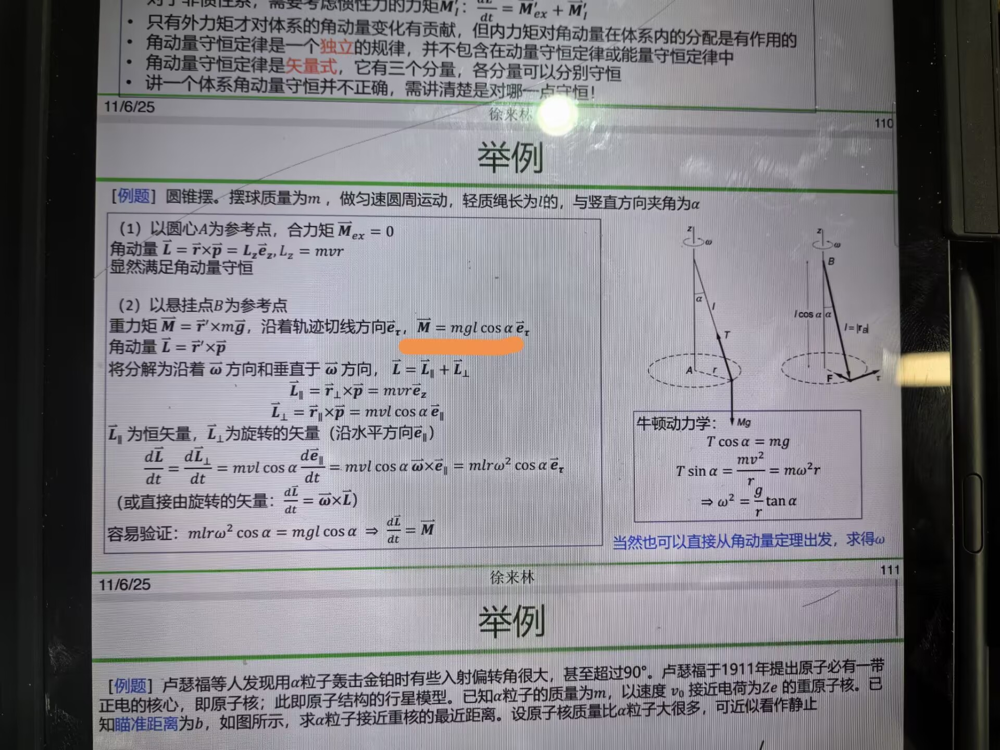
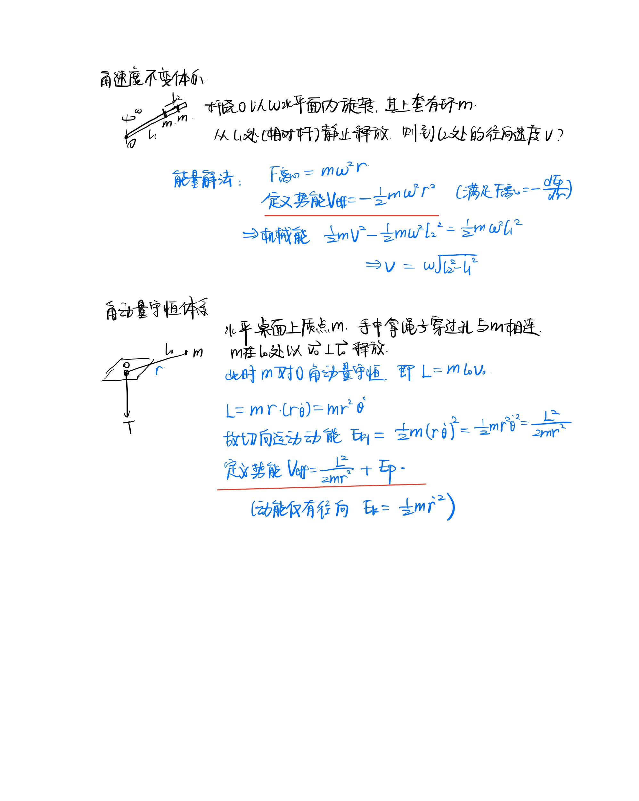
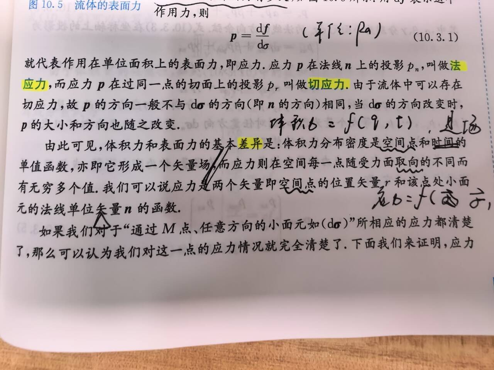

1. 胡少铠 PB25511991：
助教好，上课讲的对称性和守恒律不是太理解，上网一搜索就是从拉格朗日方程开始...所以为什么空间平移不变性是动量守恒的来源啊？动量守恒不就是m和v不变么，好像跟平不平移空间没什么关系呀。还有还有，时间平移不变性为什么是能量守恒的来源？好像相关的推导都没涉及到时间呀。

2. 易俊驰 PB25000114：

这个矩阵为什么自伴

3. 易俊驰 PB25000114：

怎么理解这个微分方程的解法以及一堆特解的形式

4. 陈必昊 PB25020563：

这里我写写怎么是sina，这不是一个叉乘absina嘛，这里是ppt有问题

5. 吕峻熙 PB25000095：
为什么质点的动能定理和动量定理实际上是一个方程。而质点系中就是相互独立的方程了。

6. 冯子禾 PB25000081：

做题时常用到这两种“有效势能”，都可以把问题简化为只在径向考虑，但是这二者形式上大相径庭，我总是背下解题的套路，那么有没有更高层次的理解

7. 胡少铠 PB25511991：

助教好，我对体积力和表面力的基本差异这一段有疑问，体积力与空间点和时间有关没问题，但是应力不应该不仅和空间点和受力面取向有关还时间有关吗？为什么这里没有说应力和时间有关？
